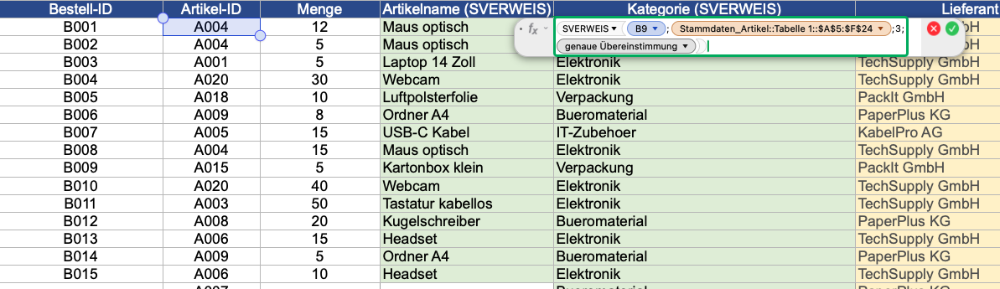
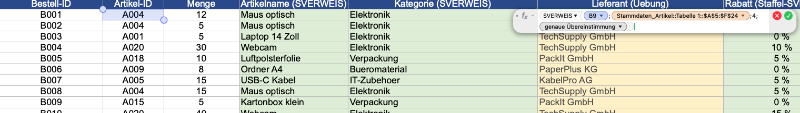
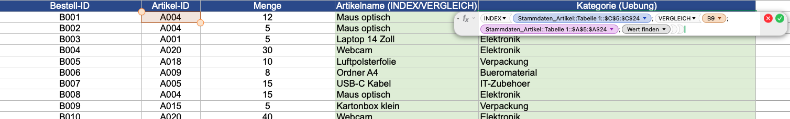
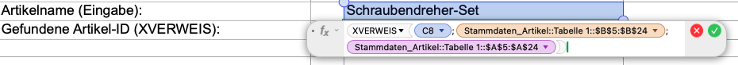

# Nachschlags--und-Referenzfunktionen (Auswertungen von Daten mit SVERWEIS, WVERWEIS, XVERWEIS, INDEX_VERGLEICH
Hole aus den Artikel-Stammdaten Artikelname, Kategorie und Lieferant zur jeweiligen Artikel-ID.
Gleiche Aufgabe mit Index_vergleich
Artikelname finden. Kategorie finden, Status der letzten Bestellung finden

